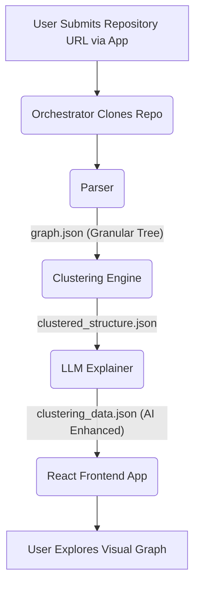

# Data Flow Pipeline

The system is currently operated sequentially under the `server` orchestrator. The typical execution data flow proceeds as follows:

## Input/Output Artifacts

1. **`graph.json`**
    * **Producer:** `parser.py`
    * **Consumer:** `run_clustering.py`
    * **Description:** A highly detailed collection of raw semantic references. Includes lists of nodes (classes, files, methods) and edges (containment, specific method calls).
2. **`clustered_structure.json`**
    * **Producer:** `clustering.py`
    * **Consumer:** `explainer.py`
    * **Description:** Represents grouped arrays of source code files (`cluster_0 = [file1, file2]`) and the aggregated weight of external links calling out between clusters.
3. **`clustering_data.json`**
    * **Producer:** `explainer.py`
    * **Consumer:** `app/public/`
    * **Description:** The ultimate human-readable end product. Consists of a global `system_story`, the pipeline array of individual AI-explained cluster definitions (title, role, inputs/outputs, interesting patterns), and a flow array denoting the mathematical connectivity.
